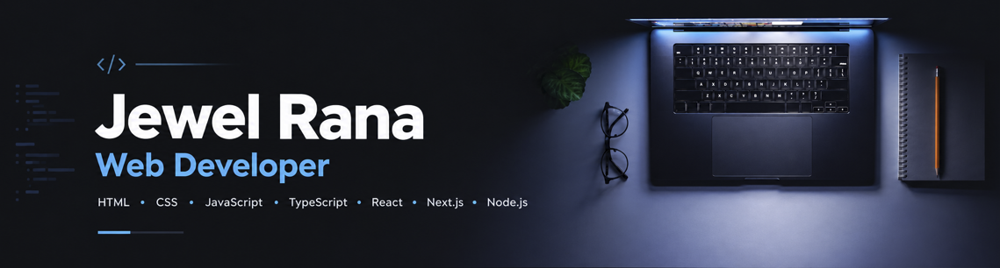

<h2></h2>

<h2></h2>

 

### Frontend Developer in Progress | React | Next.js | TypeScript

I'm a freelancer transitioning into web development, currently focused on building modern and responsive web applications with JavaScript, TypeScript, React, and Next.js.

🌱 Currently learning React, TypeScript & Next.js 
💻 Building projects with React + Vite + Tailwind CSS 
🚀 Interested in remote web development opportunities 
🎯 Long-term goal: Build useful web products and solve real-world problems 
📍 Bangladesh 

📚 Currently Learning 
-JavaScript & Problem Solving 
-TypeScript 
-React 
-Next.js 
-REST API & Data Fetching 
-Responsive Web Design 
-Git & GitHub 
-Modern Frontend Development 

### 🎯 My Goal: 
Learn continuously, build real-world projects, solve business problems, and grow into a professional remote web developer. 
⭐ Thanks for visiting my profile!
